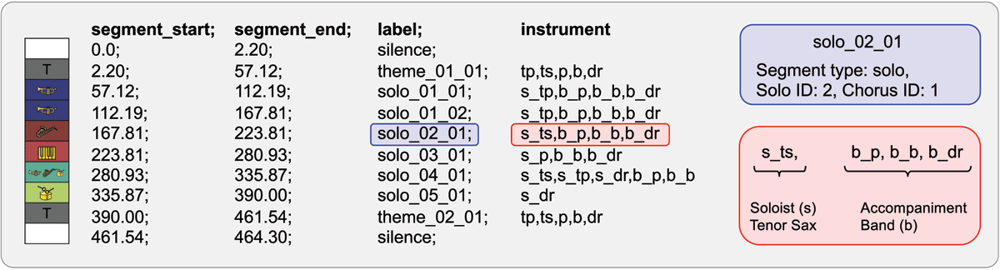

# Jazz

El jazz es un estilo musical caracterizado por la **improvisación** y la **expresividad tímbrica**, y presenta una estructura musical distintiva anclada en formas armónicas recurrentes.
Estas estructuras, conocidas formalmente como *choruses*, sirven como base para que los musicos *exploren* nuevas ideas mediante la *improvisación*.
A lo largo de una canción, esta forma da lugar a distintos segmentos que pueden identificarse como secciones temáticas, pasajes solistas y momentos de ensamble.

```{r, fig.margin = TRUE, echo = FALSE}

```

Las secciones dentro de una obra no solo se diferencian por su función formal, como hemos mencionado, sino también por su *variabilidad* en la instrumentación, la *dinámica* y la *duración*.
A estos cambios los denominaremos **transiciones musicales**, ya que representan puntos de inflexión dentro de la narrativa sonora.

```{r, echo = FALSE}

```

Por lo que, abordaremos la tarea de modelar dichas transiciones, identificando cambios sustanciales en parámetros como la **duración de los segmentos** y la **combinación de instrumentos activos**.
Dado que los jazzistas alternan entre roles de solista y acompañante a lo largo de una interpretación, las transiciones pueden ir desde pasajes **homogéneos** (con instrumentos y duraciones similares) hasta **cortes disruptivos** en los que cambian tanto el timbre como la función musical.



Para medir el grado de disrupción como una variable entre $(0, 1]$ definimos la siguiente formula:

$$
T^i_j = \alpha \cdot \left| \frac{d^i_j - d^i_{j-1}}{d^i_{\text{max}} - d^i_{\text{min}}} \right| 
+ (1 - \alpha) \cdot \left| \frac{|\mathcal{I}^i_j \,\triangle\, \mathcal{I}^i_{j-1}|}{|\mathcal{I}^i_{\text{global}}|} \right|, 
\quad \forall i \in \text{Canciones}, \ \forall j \in \text{Segmentos}
$$

Donde:

1.  $d^i_j$: Duración del segmento *j* en la canción *i*.
2.  $\mathcal{I}^i_{j}$: Conjunto de instrumentos activos en el segmento *j* de la canción *i*.
3.  $\mathcal{I}^i_{\text{global}}$: Conjunto total de instrumentos en la canción *i*.

En particular para este ejercicio setearemos el parametro $\alpha = 0.3$.

## Trabajar el dataframe

```{r,message=FALSE,warning=FALSE}
#Required libraries
library(lmtest)
library(stargazer)
library(paqueteadp)
library(remotes)
library(ggcorrplot)
library(tidyverse)
library(cowplot) # dos o m?s gr?ficos uno al lado del otro
library(caret) # data partition
library(glmnet) # Ridge
library(car)
library(gghighlight)
library(rlang)
library(tidyverse)
library(tidymodels)
library(schrute)
library(lubridate)
library(knitr)
library("scales") 
library(ggsci)

```

```{r,message=FALSE,warning=FALSE}
songs <- read.csv("./data/transitions_combined.csv", sep=",")
instruments <- read.csv("./data/instruments.csv", sep=";")
```

```{r,message=FALSE,warning=FALSE}
glimpse(songs)
glimpse(instruments)
```

```{r,message=FALSE,warning=FALSE}
songs <- songs %>%
  arrange(song_artist, song_title, segment_start) %>%
  group_by(song_artist, song_title) %>%
  mutate(
    segment_id = row_number(),
    label_base = str_remove(label, "_[0-9]+.*"),
    label_next = str_remove(lead(label), "_[0-9]+.*"),
    instr_prev = str_split(instrument, ","),
    instr_next = str_split(lead(instrument), ","),
    soloist_prev = str_extract(instrument, "s_[^,]+"),
    soloist_next = str_extract(lead(instrument), "s_[^,]+")
  )
```

```{r,message=FALSE,warning=FALSE}
songs <- songs %>%
  mutate(
    duration_prev = segment_end - segment_start,
    duration_next = lead(segment_end) - lead(segment_start),
    duration_ratio = duration_next / duration_prev,
    same_type = as.integer(label_base == label_next),
    soloist_changed = as.integer(soloist_prev != soloist_next),
    n_instr_prev = map_int(instr_prev, ~ sum(.x != "")),
    n_instr_next = map_int(instr_next, ~ sum(.x != "")),
    delta_instr_count = abs(n_instr_prev - n_instr_next),
    transition_type = factor(paste(label_base, label_next, sep = "-"))
  )
```

```{r,message=FALSE,warning=FALSE}
songs <- songs %>%
  mutate(
    time_elapsed = segment_end - min(segment_start, na.rm = TRUE),
    song_end = max(segment_end, na.rm = TRUE),
    time_remaining = song_end - segment_end,
    avg_duration = mean(duration_prev, na.rm = TRUE),
    time_deviation = abs(duration_prev - avg_duration) / avg_duration,
    narrative_variability = abs(time_elapsed - time_remaining) / song_end
  ) %>%
  ungroup()
```

```{r,message=FALSE,warning=FALSE}
alpha <- 0.3

songs <- songs %>%
  group_by(song_artist, song_title) %>%
  mutate(
    d_min = min(duration_prev, na.rm = TRUE),
    d_max = max(duration_prev, na.rm = TRUE),
    dur_norm = abs(duration_prev - lag(duration_prev)) / (d_max - d_min),

    instr_set = instr_prev,
    instr_prev_set = lag(instr_prev),
    instr_global_all = list(unique(unlist(instr_prev))),
    n_global_instr = map_int(instr_global_all, length),

    delta_instr_set = map2_dbl(instr_set, instr_prev_set, ~ {
      if (is.null(.x) || is.null(.y)) return(0)
      length(setdiff(.x, .y)) + length(setdiff(.y, .x))
    }),

    instr_norm = delta_instr_set / n_global_instr,
    T_score = alpha * dur_norm + (1 - alpha) * instr_norm
  ) %>%
  select(
    song_artist, song_title, segment_id,
    duration_prev, duration_ratio,
    same_type, soloist_changed, n_instr_prev, delta_instr_count,
    transition_type, time_deviation, narrative_variability,
    T_score
  ) %>%
  ungroup()

```

Eliminaremos los silencios ya que no son objeto de nuestro interes.

```{r,message=FALSE,warning=FALSE}
songs <- songs %>%
  filter(!is.na(T_score)) %>% mutate(across(everything(), ~ replace_na(.x, 0)))%>%
  mutate(
    same_type = factor(same_type),
    soloist_changed = factor(soloist_changed),
    n_instr_prev = factor(n_instr_prev)
  )


```

# Estadistica descriptiva

```{r,message=FALSE,warning=FALSE}
summary(songs)
```

```{r,message=FALSE,warning=FALSE}
pl0 <- ggplot(songs, aes(x = T_score)) + 
  geom_histogram(aes(y = ..density..), colour = "#5DADE2", fill = "#5DADE2", alpha = 0.2, binwidth = 0.05)+
  geom_density(alpha = .2, fill = "#191970", colour = '#191970') +
  theme_minimal() + labs(title = "Densidad del T-score",
                         x="T-score",
                         y="Densidad")

pl0
```

```{r,message=FALSE,warning=FALSE}
ggplot(songs, aes(x = narrative_variability, y = T_score)) +
  geom_jitter(alpha = 0.4, color = "#2c3e50") +
  geom_smooth(method = "lm", se = FALSE, color = "#2980b9") +
  labs(title = "T-score vs. Variabilidad Narrativa",
       x = "Narrative Variability",
       y = "T-score") +
  theme_minimal()

```

```{r,message=FALSE,warning=FALSE}
ggplot(songs, aes(x = transition_type, y = T_score, fill = transition_type)) +
  geom_boxplot() +
  theme_minimal() +
  labs(title = "Distribución del T-score por tipo de transición",
       x = "Tipo de transición", y = "T-score") +
  theme(axis.text.x = element_text(angle = 45, hjust = 1),legend.position = "none")

```

```{r,message=FALSE,warning=FALSE}
pl1 <- ggplot(songs, aes(x = T_score, fill = soloist_changed)) +
  geom_density(alpha = 0.5) +
  labs(title = "Densidad del T-score",
       x = "T-score", fill = "¿Cambio de\n solista?") +
  scale_fill_manual(values = c("0" = "#7f8c8d", "1" = "#e74c3c")) +
  theme_minimal()


pl2 <- ggplot(songs, aes(x = T_score, fill = same_type)) +
  geom_density(alpha = 0.5) +
  labs(title = "Densidad del T-score",
       x = "T-score", fill = "¿Mismo tipo\n de segmento?") +
  scale_fill_manual(values = c("0" = "#6e3b3b", "1" = "#e09f3e")) +
  theme_minimal()

plot_grid(pl1,pl2,labels=c("A","B"),label_size = 12, ncol = 1)
```

```{r,message=FALSE,warning=FALSE}
songs_num <- songs %>% 
  select(duration_prev,duration_ratio,time_deviation,narrative_variability, delta_instr_count, T_score)

corr_matrix <- cor(songs_num) %>% 
  round(1)

graf_corr <- ggcorrplot(corr_matrix, 
                        hc.order = TRUE,
                        type = "lower",
                        outline.color = "white",
                        colors = c("#3B0A0A", "white", "#E09F3E"),
                        lab = TRUE)

graf_corr
```

```{r,message=FALSE,warning=FALSE}
ggplot(songs, aes(x = n_instr_prev, y = T_score, fill = n_instr_prev)) +
  geom_boxplot(width = 0.5, outlier.shape = NA) +
  scale_fill_viridis_d(option = "D") +
  theme_minimal() +
  labs(
    title = "Distribución del T-score según número de instrumentos",
    x = "Cantidad de instrumentos",
    y = "T-score"
  ) +
  theme(legend.position = "none")


```

Pasemos al modelado

```{r,message=FALSE,warning=FALSE,results='asis'}

model_1 <- lm(T_score~same_type+soloist_changed+n_instr_prev+transition_type+narrative_variability+narrative_variability,data = songs)
  
stargazer(model_1,type = 'html',align = TRUE)
```

```{r,message=FALSE,warning=FALSE}
coef <- model_1$coefficients %>%
  enframe(name = "predictor", value = "coeficiente")

coef %>%
  filter(predictor != "(Intercept)") %>%
  ggplot(aes(x = predictor, y = coeficiente)) +
  geom_col(fill = "#E09F3E") +
  labs(title = "Coeficientes del modelo OLS") +
  theme_bw() +
  theme(axis.text.x = element_text(size = 7, angle = -40))
```

```{r,message=FALSE,warning=FALSE}
songs$pred <- model_1$fitted.values
ggplot(songs, aes(x = duration_prev)) +
  geom_point(aes(y = T_score, color = "Datos"), size = 1, alpha = 0.6) +
  geom_line(aes(y = pred, color = "Predichos"), size = 0.4) +
  scale_color_manual(name = "Series", values = c("Datos" = "#E09F3E", "Predichos" = "#3B0A0A")) +
  coord_cartesian(xlim = c(0, max(songs$duration_prev, na.rm = TRUE)),
                  ylim = c(0, 1)) +
  ggtitle("Regresión Multivariada") +
  xlab("Duración del segmento") +
  ylab("T-score") +
  theme_minimal(base_size = 14) 
```

Recordando ayudantías pasadas

### Significancia global

Para evaluar significancia global, realizamos una descomposición de varianza.

1.  $SST=\sum_{i=1}^{N}{(y_i-\bar{y})^2\ \ }$ **Varianza total**
2.  $SSR=\sum_{i=1}^{N}{(\widehat{y_i}-\bar{y})^2\ \ }$ **Variabilidad de la regresión**
3.  $SSE=\sum_{i=1}^{N}{\widehat{(u_i})^2\ \ }$ **Variabilidad del residuo**
4.  Se cumple que $SST=SSR+SSE$

Por lo que para evaluar significancia global, se plantea la siguiente hipotesis.

-   $H_0;\ B_i=0,\forall_i=1...K$

-   $H_a;\ B_i\neq0$

El estadístico de prueba es;

-   $F=\frac{\left(\frac{SSR}{K}\right)}{\left(\frac{SSE}{N-K-1}\right)} | F_{(K;N-k-1)}$

Este valor se refiere al test de hipotesís con $H_0$ igual a que todos los coeficientes del modelo tengan el valor de 0, el criterio mas utilizado y de mas facil interpretación es ver el valor del p-value que te otorgan los software relacionados con este test y comparas con el nivel de significancia que estableciste como evaluador, en *R* es común que aparezcan asteriscos al lado de este calculo en los summary estos representan si es significativo el estadistico.

### Significancia individual

Para evaluar significancia individual para cada variable se plantea la siguiente hipótesis:

-   $H_0;\ B_k=0$

-   $H_a;\ B_k\neq0$

El estadístico a utilizar es t.

-   $T=\frac{B_k}{SE({\hat{B}}_k)} | t_{(\alpha;N-K-1)}$

Este valor se refiere al test de hipotesís con $H_0$ iagual a que este coeficiente en especifico no aporte información al modelo o su valor sea cercano a 0.
Se recomienda observar el p-value que entregue el software.

# Diagnostico de residuos.

*Supuestos*

1.  los residuos $u_i$ tienen distribución normal.
2.  los residuos $u_i$ tienen media cero.
3.  los residuos $u_i$ tienen varianza constante.
4.  los residuos $u_i$ no estan correlacionados.

## Residuos

Los residuos en los modelos nos ayudan a; determinar que tan bien el modelo explica el patrón de los datos, verificar los supuestos del modelo.

-   $e_i=y_i-\hat{y_i}$

## Normalidad en los errores.

```{r,warning=FALSE,message=FALSE}
#Definimos la variable res_b la cual contiene los residuales del modelo planteado.
res_b <- rstandard(model_1)

#Shapiro-Wilk

#En el caso de este test la hipotesis nula es que los residuos presentan una distribución normal, con un(p-value<0.05), nos indica que se debe rechazar la hipótesis nula, los residuos no presentan una distribución normal.

shapiro.test(res_b)

#Graficamente
qqnorm(res_b,main = "Distribución de los residuos del modelo")
qqline(res_b,col="red")


```

Para que se cumpla el supuesto de normalidad de los errores se necesita que esten lo mas alineados con la recta de referencia, alejamientos severos de esta recta representarian la no normalidad.

## Residuos con media 0.

Simplemente calculamos la media de los residuos.

```{r}
res_a <- resid(model_1)
mean(res_a)
```

Como podemos observar este valor es 0, por lo que se cumple este supuesto.

## Resumen de Graficos sobre los residuos

```{r}
par(mfrow=c(2, 2))
plot(model_1, las=1, col='darkseagreen3', which=1:3)
```

# Homocedasticidad de los residuos

Recordemos que uno de los supuestos clásicos del modelo lineal es que los errores presentan varianza constante.
Para evaluar este supuesto, se plantean las siguientes hipótesis:

-   $H_0$: los errores tienen varianza constante (homocedasticidad).
-   $H_1$: los errores no tienen varianza constante (heterocedasticidad).

A continuación, se presentan distintas pruebas para evaluar este supuesto sobre los residuos del modelo estimado (`model_1`).

------------------------------------------------------------------------

### Breusch-Pagan Test

Esta prueba evalúa si la varianza de los errores está relacionada linealmente con las variables independientes del modelo.

```{r}
bptest(model_1)
```

Un p-valor bajo **(menor a 0.05)** indica evidencia para rechazar la hipótesis nula de homocedasticidad, es decir, sugiere presencia de heterocedasticidad.

### White Test

La prueba de White permite detectar formas más generales de heterocedasticidad, incluyendo relaciones no lineales entre los errores y los regresores.

```{r}
bptest(model_1,
       varformula = ~ narrative_variability + 
                    I(narrative_variability^2) + 
                     same_type + soloist_changed + 
                     n_instr_prev + transition_type,
       data = songs)
```

Tenemos evidencia sufiente para rechazar H_0 por lo que estamos ante un problema de heterocedasticidad.

```{r}
plot(fitted(model_1), resid(model_1), 
     main = "Residuos vs. Valores Ajustados", 
     xlab = "Valores ajustados", ylab = "Residuos", pch = 19,cex = 0.5, col = "#E09F3E")
abline(h = 0, col = "#3B0A0A", lwd = 2)
```

# Parte N°2

```{r}
data_2 <- read.csv("./data/propinas.csv",sep=';')
```

```{r}
glimpse(data_2)#Verificar el tipo de datos
```

```{r}
data_2$Propinas_clp <- as.numeric(data_2$Propinas_clp)
unique(data_2$dia)

#Transformamos estas variables a factor ya que son cualitativas y le damos el orden que corresponda
# segun nuestro criterio
data_2$tiempo <- factor(data_2$tiempo,c('Primer_acto','Intermedio','Segundo_acto'))
data_2$edad <- factor(data_2$edad,c('adulto_joven','adulto','senior'))
data_2$dia  <- factor(data_2$dia  ,c('Martes','Miercoles','Jueves','Viernes','Sabado','Domingo'))
unique(data_2$edad)
```

# Exploración Jazz Corner

```{r, echo = FALSE}

```

Nos traemos los datos!

```{r}
summary(data_2)
#No hay valores nulos yei
```

```{r}
p20 <- ggplot(data_2, aes(x = Propinas_clp )) +
  geom_density(alpha = .2, fill = "#4c2882", colour = '#4c2882') +
  labs(title = "Distribución de las Propinas del local") + xlab("Propinas (en $1000)")+ ylab("Densidad") +theme_minimal()
p20
```

Nuevamente el mismo caso pasado, skewness positivo, con valores atipicos lejos de la media de los datos.

```{r}

p21 <- ggplot(data_2, aes(x =N_personas )) +
  geom_histogram(binwidth = 1,alpha = 0.1,colour = "navy", fill = "#56B4E9") +
  labs(title = "Numero de personas por mesa")
p22 <- ggplot(data_2, aes(x = tiempo, fill = tiempo)) +
  geom_bar() +
  labs(title = "Tiempo de servicio") +
  scale_fill_viridis_d()+ theme(axis.text.x = element_text(size = 7, angle = -10))
p23 <- ggplot(data_2, aes(x = edad, fill = edad)) +
  geom_bar() +
  labs(title = "Edad del que paga") +
  scale_fill_viridis_d(option = "D", end = 0.8)+ theme(axis.text.x = element_text(size = 7, angle = -10))

plot_grid(p21,p22,p23,labels=c("A","B","C"),label_size = 12, ncol = 2)

```

```{r}
p24 <- ggplot(data_2, aes(x = N_personas, y = Propinas_clp)) +
  geom_point(color = "#5B888C")
p25 <- ggplot(data_2, aes(x = tiempo, y = Propinas_clp, fill = tiempo)) +
  geom_boxplot(show.legend = FALSE) +
  scale_fill_viridis_d()
p26 <- ggplot(data_2, aes(x = edad, y = Propinas_clp, fill = edad)) +
  geom_boxplot(show.legend = FALSE) +
  scale_fill_viridis_d(option = "E", end = 0.8)
plot_grid(p24,p25,p26,labels=c("D","E","F"),label_size = 12, ncol = 2)
```

```{r,results='asis'}
mod_5 <- lm(Propinas_clp~N_personas+tiempo+edad,data=data_2)

mod_6 <- lm(Propinas_clp~N_personas+tiempo+edad+dia,data=data_2)

mod_7 <- lm(log(Propinas_clp)~N_personas+tiempo+edad+dia,data=data_2)

stargazer(mod_5,mod_6,mod_7, type = "html", align=TRUE)

```

# Estadisticos de comparación

```{r}
AIC(mod_5)
BIC(mod_5)
AIC(mod_6)
BIC(mod_6)
AIC(mod_7)
BIC(mod_7)
```

## RMSE

```{r}
pred.mod_5 <- predict(mod_5, newdata = data_2)
pred.mod_6 <- predict(mod_6, newdata = data_2)

pred.mod_5 <- as.double(pred.mod_5)
pred.mod_6 <- as.double(pred.mod_6)

e1 <- sqrt(mean((pred.mod_5-data_2$Propinas_clp)^2))
e2 <- sqrt(mean((pred.mod_6-data_2$Propinas_clp)^2))
```

Nota: El RMSE sirve como criterio cuando lo utilizamos prediciendo nuevos valores o sea cuando separamos los datos en entrenamiento y testeo.
Cuando se utilizan con el mismo data set es redundante su conclusión.
